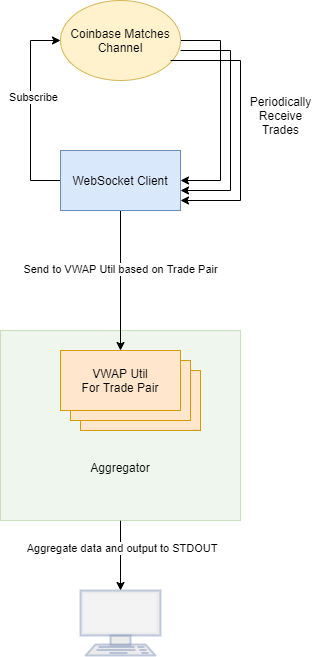

# Coinbase Exchange Matches Channel Aggregator and VWAP Calculator
Communicates with [Coinbase Websocket Matches Channel](https://docs.cloud.coinbase.com/exchange/docs/channels#match), calculates VWAP of a number of Trading Pairs using set sliding window of trades.

Configuration:

The application is configurable using the `conf.json` file in the root directory:

|Field|Type|Mandatory|Note|
|-----|----|------|----------|
|TRADE_PAIRS|[]string|yes|Represents trading pairs which will the client will subscribe to the matches channel for.|
|SOCKET_ADDRESS|string|yes|Websocket address for Coinbase Exchange server.|
|CLEAR_CONSOLE|bool|no|ONLY TESTED ON WINDOWS: clears console after every VWAP output. Results in a cleaner output, but only displays the latest VWAP.|
|WINDOW|int|yes|Represents sliding window of trades (will limit VWAP calculation to n latest trades)|

### Compilation and Execution:

- Configure application via `conf.json` (default configuration is fine)
- Vendor dependencies: `go mod vendor` 
- Build executable: `go build`
- Run executable:
  
Windows: `CoinbaseMatchesVWAP.exe`

Linux: `./CoinbaseMatchesVWAP`

### Shutdown:

Normal interrupt will trigger shutdown. 

### Testing (Unit Tests):

To execute all unit tests, run: `go test ./...`